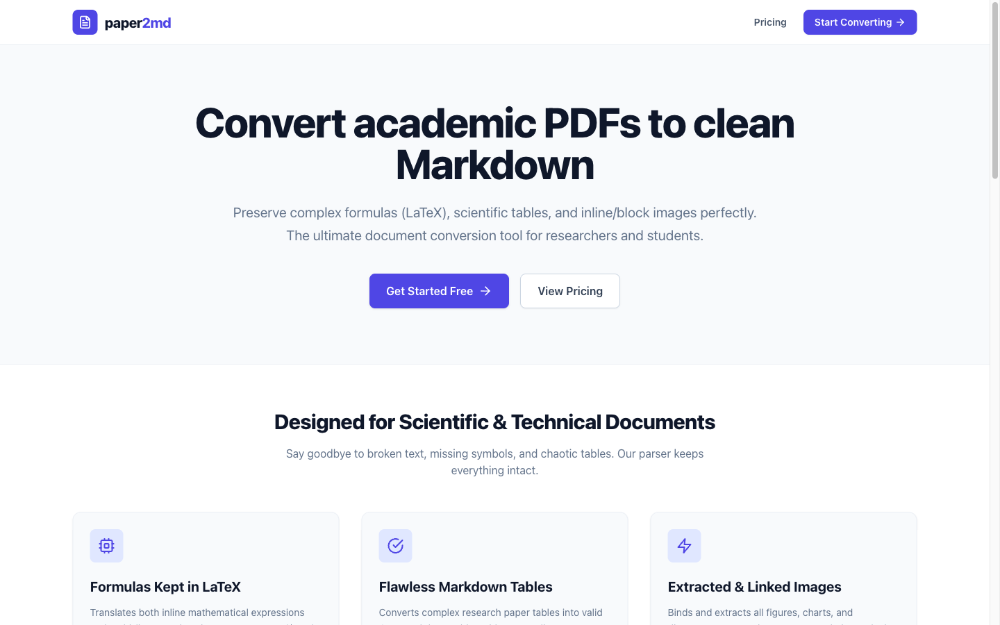
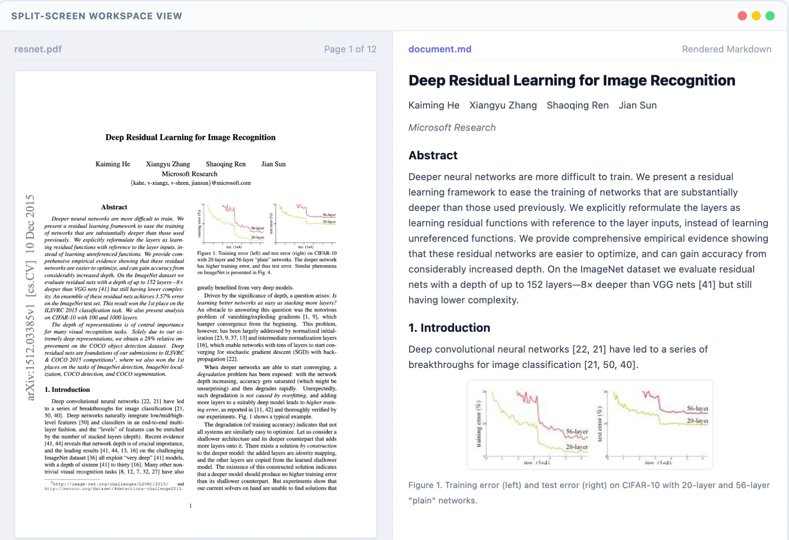

  

  <strong>Convert academic PDFs to clean Markdown — LaTeX formulas, tables, and images intact.</strong>

  
  
  
  

  

---

## What is paper2md?

**[paper2md](https://paper2md.com)** is a web tool that converts academic and technical PDFs into clean, portable Markdown. Unlike general-purpose converters, it is built specifically for research papers — handling the things that break everything else:

- Multi-line LaTeX equations with `\tag{}`, `\align`, `\begin{cases}` — rendered correctly
- Complex research tables with merged headers, borderless cells, and footnotes
- Multi-column PDF layouts (arXiv-style double-column) with correct reading order
- Figures and diagrams extracted and packaged into a ZIP with relative image paths

The output drops directly into **Obsidian**, **Notion**, and **LLM/RAG pipelines** with zero post-processing.

---

## Split-Screen Demo

Upload a PDF, get a side-by-side view of the original and the rendered Markdown. Check the conversion, then download.

  

> **Above:** ResNet paper (arXiv:1512.03385) — 12 pages, multi-column layout, complex equations. Left panel: original PDF. Right panel: rendered Markdown with KaTeX formulas.

---

## Real-World Benchmark

Tested on **"Deep Residual Learning for Image Recognition"** (He et al., 2015 — arXiv:1512.03385), a challenging 12-page double-column arXiv paper:

| Metric | Result |
|--------|--------|
| Pages processed | 12 |
| LaTeX formulas | **79 formulas, 0 rendering errors** |
| Tables converted | 15 valid GFM tables |
| Figures extracted | 10 figures, correct relative paths |
| Obsidian render | ✅ Zero edits required |
| Multi-column order | ✅ Left column → right column (correct) |

### Formula Output Example

| | Content |
|---|---|
| ❌ **Before** (raw PDF text) | `-(ħ²/2m) ∇²Ψ(r) + V(r)Ψ(r) = EΨ(r)` |
| ✅ **After** (paper2md) | See rendered formula below |

$$
-\frac{\hbar^2}{2m} \nabla^2 \Psi(\mathbf{r}) + V(\mathbf{r})\Psi(\mathbf{r}) = E\Psi(\mathbf{r})
$$

KaTeX/MathJax/Obsidian compatible — zero `\tag{}` errors, correct `$$` block delimiters.

### Table Output Example

| | |
|---|---|
| ❌ **Before** (raw PDF text) | Garbled columns, broken alignment, missing separators |
| ✅ **After** (paper2md) | Valid GFM table, renders anywhere |

| Method | top-1 err. | top-5 err. |
|--------|-----------|-----------|
| VGG-16 | 28.07 | 9.33 |
| ResNet-34 | 25.03 | 7.76 |
| ResNet-50 | 22.85 | 6.71 |
| ResNet-101 | 21.75 | 6.05 |
| ResNet-152 | **21.43** | **5.71** |

---

## Features

### 🔢 LaTeX Formula Preservation
Both inline (`$...$`) and block (`$$...$$`) formulas are extracted and normalized:
- `\(...\)` → `$...$` (Obsidian-compatible inline)
- `\[...\]` → `$$\n...\n$$` (block, prevents `\tag{}` parse errors)
- Single-line `$$...$$` expanded to three-line block form
- Reference brackets like `\[41\]` are not mistakenly converted

### 📊 Flawless GFM Tables
Converts complex research paper tables — including borderless, merged-header, and multi-row tables — into valid [GitHub-Flavored Markdown](https://github.github.com/gfm/) tables with correct alignment.

### 🖼️ Image Extraction & Packaging
All figures, charts, and diagrams are:
- Extracted from the PDF
- Stored as `images/img-N.jpeg` with relative paths
- Packaged into a downloadable ZIP alongside `document.md`

### 🔍 Split-Screen Review
Side-by-side view of the original PDF (rendered via pdf.js) and the converted Markdown (rendered with KaTeX + remark-gfm). Each formula block and table has a **hover-to-copy** button.

### ⚡ Fast & Zero Setup
No installation, no CLI, no GPU required. Upload → Convert → Download. A typical 12-page arXiv paper converts in under 30 seconds.

---

## Pricing

| Plan | Pages | Price | Notes |
|------|-------|-------|-------|
| **Free** | 100 pages/month | $0 | No credit card required |
| **Pro** | 2,000 pages/month | $6.99/mo | 50 MB file limit, up to 1,000 pages/doc |
| **Booster Pack** | +500 pages | $2.99 one-time | Never expire, stack with any plan |

[→ View full pricing](https://paper2md.com/pricing)

---

## Who Is It For?

**Researchers & Students**
Convert arXiv papers into Obsidian notes with formulas that actually render. No more copying garbled LaTeX by hand.

**AI / ML Engineers**
Clean Markdown is significantly better than raw PDF text for RAG pipelines. Semantic chunking by section headers, LaTeX preserved in embeddings.

**Knowledge Workers**
Import technical documentation, whitepapers, and reports into Notion or Obsidian without losing tables or structure.

---

## How to Use

1. **Go to [paper2md.com](https://paper2md.com)** and sign in (Google or email — free)
2. **Upload your PDF** — drag and drop, up to 20 MB on Free plan
3. **Wait for conversion** — typically 10–30 seconds for a standard paper
4. **Review in the split-screen editor** — verify formulas and tables render correctly
5. **Download** — `.md` file only, or **ZIP** with `document.md` + `images/` folder

---

## Compared to Alternatives

| | paper2md | Marker | MinerU | Mathpix | Pandoc |
|---|:---:|:---:|:---:|:---:|:---:|
| LaTeX accuracy | ✅✅ | ✅ | ✅ | ✅✅ | ❌ |
| GFM tables | ✅✅ | ✅ | ✅✅ | ✅ | ⚠️ |
| Multi-column order | ✅ | ✅ | ✅ | ✅ | ❌ |
| Zero setup (web) | ✅ | ❌ | ❌ | ✅ | ✅ |
| Free tier | ✅ 100p/mo | ✅ OSS | ✅ OSS | ❌ | ✅ |
| Obsidian-ready output | ✅ | ⚠️ | ⚠️ | ⚠️ | ❌ |
| GPU required | ❌ | ⚠️ | ✅ | ❌ | ❌ |

---

## Privacy

- Uploaded PDFs are **automatically deleted within 1 day**
- Converted outputs are deleted within 7 days
- Your documents are **never used to train AI models**
- Powered by [Mistral AI OCR](https://mistral.ai) — not affiliated with or endorsed by Mistral AI

---

## Links

- 🌐 **Website:** [paper2md.com](https://paper2md.com)
- 💬 **Support:** [support@paper2md.com](mailto:support@paper2md.com)
- 📄 **Terms:** [paper2md.com/terms](https://paper2md.com/terms)
- 🔒 **Privacy:** [paper2md.com/privacy](https://paper2md.com/privacy)

---

  

